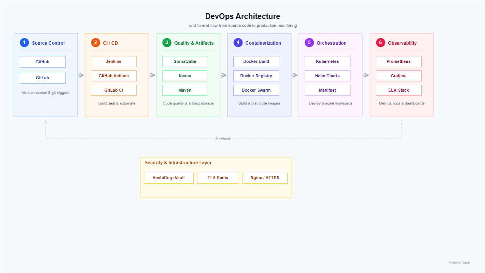

 

  
  
  
  

 

# 💻 DevOps Portfolio

I am a DevOps Engineer focused on building production-grade systems using CI/CD pipelines, container orchestration, observability stacks, and secure infrastructure design.

All projects are built and validated in real environments using VMs, containers, and Kubernetes clusters.

 

CI/CD → Build → Test → Containerize → Deploy → Monitor

---

## 🧭 Core Areas

CI/CD Automation • Kubernetes • Docker • Observability • Infrastructure as Code • DevSecOps

---

## 🧱 System Architecture Overview

  

---

## 🔁 CI/CD & Automation

<b>View CI/CD Projects</b>

- ⚙️ **devops-ci-cd-pipeline-jenkins**  
  Jenkins • SonarQube • Nexus • Docker • staging VM  

- ⚙️ **devops-ci-cd-pipeline-github-actions**  
  Multi-env pipelines • Semantic versioning • Notifications  

- ⚙️ **devops-ci-cd-pipeline-gitlab-ci**  
  Docker • GitLab runners • staging deployment  

[Explore CI/CD →](ci-cd-pipelines/README.md)

---

## 🐳 Containerization & Kubernetes

<b>View Kubernetes & Docker Projects</b>

- ☸️ **microservices-devops-monorepo**  
  Docker • Microservices • Nginx • CI/CD pipelines  

- ☸️ **docker-microservices**  
  Docker Swarm • Eureka • HTTPS • Service discovery  

- ☸️ **kubernetes-helm-deployment**  
  Helm • Jenkins • Kubernetes • CI/CD integration  

- ☸️ **k8s-minikube-vs-cluster**  
  Minikube vs production cluster deployment  

[Explore Kubernetes →](containerization-and-kubernetes/README.md)

---

## 📊 Observability & Monitoring

<b>View Monitoring Projects</b>

- 📊 **monitoring-grafana-prometheus-k6**  
  Metrics • Dashboards • Load testing • Observability pipelines  

- 📊 **elk-monitoring-stack**  
  Elasticsearch • Logstash • Kibana • Centralized logging  

[Explore Monitoring →](monitoring-and-logging/README.md)

---

## 🔐 Security & Secrets

<b>View Security Projects</b>

- 🔐 **redis-vault-spring-boot**  
  Vault • TLS Redis • Spring Boot • Secure configuration  

[Explore Security →](security-and-secrets/README.md)

---

## ⚙️ Automation & Utilities

<b>View Scripts & Tools</b>

- ⚙️ **devops-scripts**  
  Bash automation • Docker utilities • Monitoring scripts  

[Explore Tools →](scripts-and-experiments/README.md)

---

## 🧩 Backend Systems

<b>View Backend Projects</b>

- 🧩 **springboot-elasticsearch-files**  
  Spring Boot • Elasticsearch • Docker • REST APIs  

[Explore Backend →](springboot-elasticsearch-files/README.md)

---

## 🚀 Featured Work

<b>Production-grade DevOps systems built for real-world workflows</b>

---

### ⚙️ CI/CD Platform Engineering
Jenkins-based enterprise pipeline system

- Multi-stage CI/CD pipeline
- SonarQube quality gates
- Nexus artifact repository
- Dockerized deployments
- VM-based staging environment

**Stack:** Jenkins • Maven • SonarQube • Nexus • Docker  

---

### ☸️ Kubernetes Helm Platform
Production Kubernetes deployment system

- Helm-based deployments
- Multi-environment strategy
- Jenkins integration
- Git-triggered deployments

**Stack:** Kubernetes • Helm • Jenkins • Docker  

---

### 📊 Observability Stack
Monitoring and performance system

- Prometheus metrics
- Grafana dashboards
- k6 load testing
- System observability pipelines

**Stack:** Prometheus • Grafana • k6  

---

### 🔐 Secure Infrastructure System
Vault-secured backend platform

- HashiCorp Vault integration
- AppRole authentication
- TLS Redis layer
- Spring Boot backend

**Stack:** Vault • Redis • Spring Boot  

---

### 🐳 Microservices Platform
Docker-based distributed system

- Docker Swarm orchestration
- Service discovery (Eureka)
- Multi-service architecture
- CI/CD automation

**Stack:** Docker • Spring Boot • Eureka  

---

## 📬 Contact

