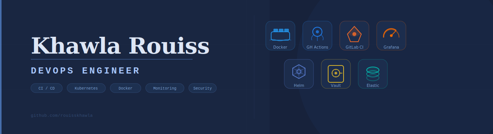

 

# 💻 DevOps Portfolio

I’m a DevOps Engineer who has built these projects using real pipelines, VMs, and deployments.  
Everything here has run or currently runs in working environments.

This portfolio covers:
CI/CD across multiple platforms, container orchestration from Docker to Kubernetes clusters, observability stacks, and secrets management with Vault.

 

 

## 🔁 CI/CD & Automation

Projects showcasing automated pipelines for building, testing, and deploying applications using Jenkins, GitHub Actions, and GitLab CI.

<b>CI/CD Projects</b>

- **devops-ci-cd-pipeline-jenkins**  
  Jenkins • SonarQube • Nexus • Docker • staging VM  

- **devops-ci-cd-pipeline-github-actions**  
  Semantic versioning • Multi-env pipelines • Slack notifications  

- **devops-ci-cd-pipeline-gitlab-ci**  
  Docker • Shell runners • staging deployment  

[Explore CI/CD Projects →](ci-cd-pipelines/README.md)

 

 

## 🐳 Containerization & Kubernetes

Docker-based microservices, Kubernetes deployments, and Helm-based orchestration workflows.

<b>Containerization & Kubernetes Projects</b>

- **microservices-devops-monorepo**  
  Docker • Microservices • Nginx • GitHub Actions • self-signed certificates  

- **docker-microservices**  
  Docker Swarm • Multi-service architecture • Eureka • HTTPS • DNS  

- **kubernetes-helm-deployment**  
  Kubernetes • Helm • Jenkins • Branch-based CI/CD • versioning  

- **k8s-minikube-vs-cluster**  
  Jenkins • Minikube • Production cluster deployment • Git webhooks  

[Explore Containerization Projects →](containerization-and-kubernetes/README.md)

 

 

## 📊 Monitoring & Logging

Observability solutions for metrics, logs, dashboards, and performance testing.

<b>Monitoring & Logging Projects</b>

- **monitoring-grafana-prometheus-k6**  
  Prometheus • Grafana • k6 • Load testing • system metrics  

- **elk-monitoring-stack**  
  Elasticsearch • Logstash • Kibana • Spring Boot logging  

[Explore Monitoring Projects →](monitoring-and-logging/README.md)

 

 

## 🔐 Security & Secrets

Secure configuration management and encrypted application design.

<b>Security & Secrets Projects</b>

- **redis-vault-spring-boot**  
  Vault • TLS Redis • Spring Boot • Secrets management  

[Explore Projects →](security-and-secrets/README.md)

 

 

## ⚙️ Scripts & Experiments

Automation scripts and DevOps utilities built for real-world workflow optimization.

<b>Scripts & Experiments</b>

- **devops-scripts**  
  Bash • Docker • Automation • Monitoring utilities  

[Explore Projects →](scripts-and-experiments/README.md)

 

 

## 📊 Backend Projects

Spring Boot applications designed with DevOps-friendly architecture.

<b>Backend Projects</b>

- **springboot-elasticsearch-files**  
  Spring Boot • Elasticsearch • Docker • REST APIs • TLS  

[Explore Backend Projects →](springboot-elasticsearch-files/README.md)
