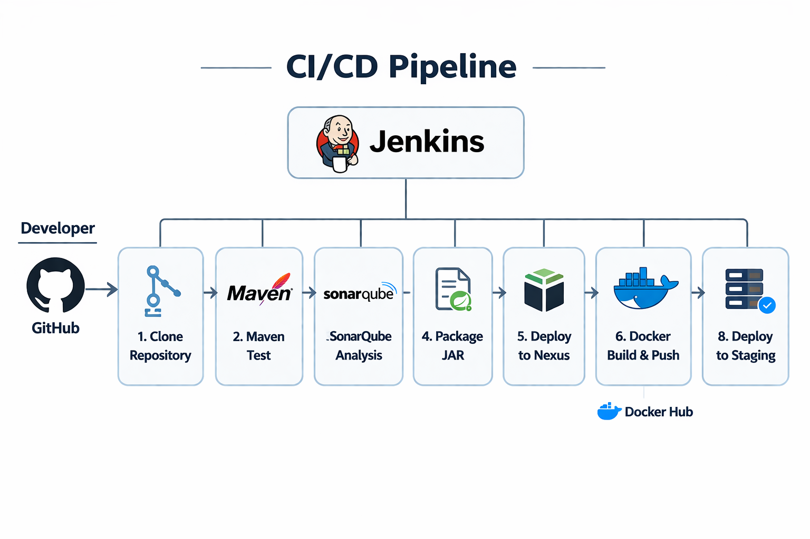

# DevOps CI/CD Pipeline – Jenkins

**Skills:** Jenkins, Maven, SonarQube, Nexus, Docker, Docker Compose, Multi-VM Deployment

**Overview:**  
A complete CI/CD pipeline for a Spring Boot application. Automates build, test, code quality, packaging, Docker image creation, and deployment to a staging environment.

**Architecture:**  

  

**Key Highlights:**  
- Jenkinsfile defines all pipeline stages and credentials  
- Maven unit tests and SonarQube analysis  
- Artifact upload to Nexus  
- Docker build & deployment to staging VM using Docker Compose  
- Secure credentials and environment variables  

**Original Repository:**  
[View on GitHub](https://github.com/rouisskhawla/devops-ci-cd-pipeline-jenkins)